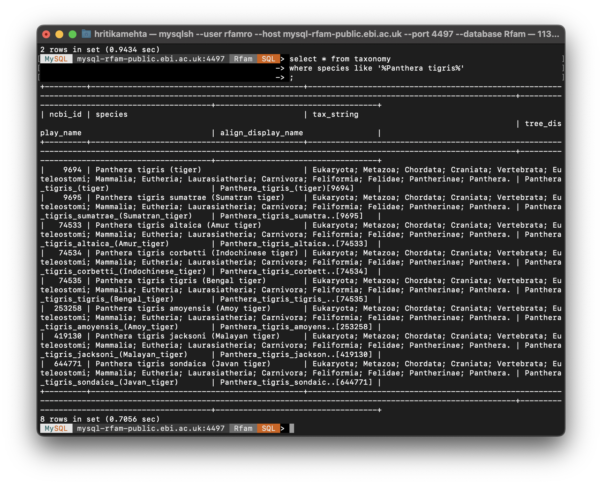
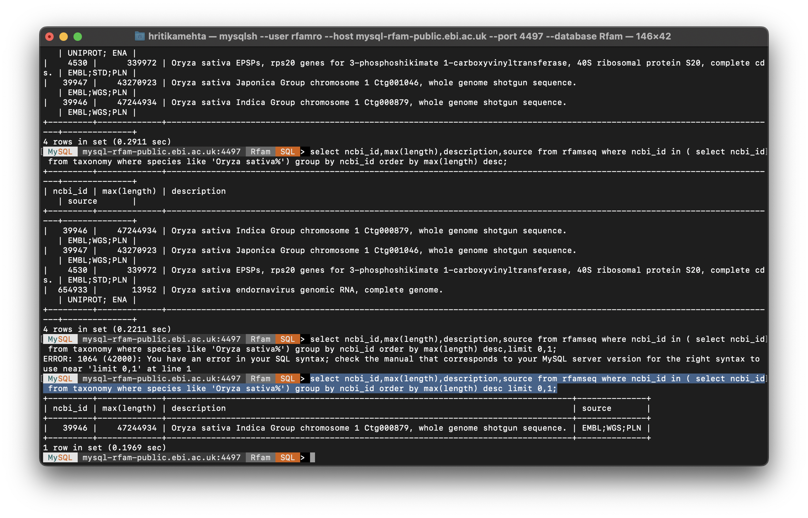

# 1. The following questions test your aptitude for interacting with databases. 
> The questions are based off the following public SQL DB: https://docs.rfam.org/en/latest/database.html

## Q A. How many types of tigers can be found in the taxonomy table of the dataset? What is the "ncbi_id" of the Sumatran Tiger? 
> (hint: use the biological name of the tiger)

**Ans:**
```sql
SELECT COUNT(*) FROM taxonomy WHERE species like '%Panthera tigris%';
```
* Using the above query, there are **`8`** different types of tigers

```sql
SELECT ncbi_id FROM taxonomy WHERE species like '%Panthera tigris Sumatrae%';
```
* Using this query we can get the ncbi_id of the *Sumatran Tiger* - **`9695`**



## B. Find all the columns that can be used to connect the tables in the given database.

**Ans:**
* from table rfamseq it is ncbi_id
* from table family it is rfam_acc, rfam_id
* from table taxonomy it is ncbi_id
* from table clan_membership it is rfam_acc, clan_acc
* from table clan it is clan_acc
* from table full_region it is rfam_acc, rfamseq_acc

## C. Which type of rice has the longest DNA sequence?
> (hint: use the rfamseq and the taxonomv tables)

**Ans:**
```sql
SELECT ncbi_id, MAX(length), description FROM rfamseq 
WHERE ncbi_id in 
	(SELECT ncbi_id from taxonomy WHERE species like '%Oryza sativa%')
GROUP BY ncbi_id 
ORDER BY MAX(length) DESC
LIMIT 0, 1;
```
* Using the query above, the type of rice that has the longest DNA Sequence is  **`Oryza Sativa indica`**.



## D. We want to paginate a list of the family names and their longest DNA sequence lengths (in descending order of length) where only families that have DNA sequence lengths greater than 1,000,000 are included. Give a query that will return the 9th page when there are 15 results per page. 
> (hint: we need the family accession ID, family name and the maximum length in the results)

**Ans:**
```sql
SELECT f.description, fam.* FROM family f 
JOIN (SELECT rf.rfamseq_acc, MAX(rf.length) length, fr.rfam_acc 
	  FROM rfamseq rf JOIN full_region fr 
	  			ON rf.rfamseq_acc = fr.rfamseq_acc 
	  WHERE rf.length > 1000000
	  GROUP BY fr.rfam_acc) fam
ON fam.rfam_acc = f.rfam_acc
ORDER BY fam.length DESC
LIMIT 121, 15;
```
* In the above query row number 121 is the OFFSET as 9th page begins from row_num=121.
* The query returns the 9th page of families with longest DNA sequence.


# This question is to test our aptitude for writing small shell scripts on Unix.
>You are given this URL https://www.amfiindia.com/spades/NAVAIl.txt. Write a shell script that extracts the Scheme Name and Asset Value fields only and saves them in a csv file.

**Ans:**
```bash
# Without headers
awk -F ';' '{print $4 "," $5}' AA_test.txt > AA_test.csv

# With headers
awk -F ';' '{if ( $1=="" || $4=="" )
				print $1
			else 
				print $4 "," $5}' AA_test.txt > AA_test_header.csv;
```

* The code without headers will not include company names in the CSV file, and leave the line as blank.
* The code with headers will include the company names in the CSV file.
* Find the respective CSV files in this repository.